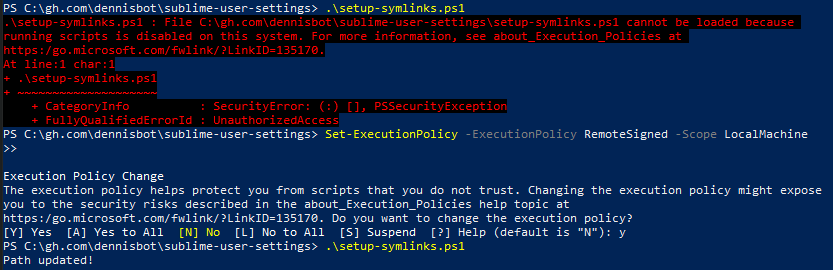

# git-bash dotfiles and windows-terminal symlink setup (windows only)

## Setup Scripts

This repository contains two PowerShell scripts for setting up symbolic links:

### 1. Dotfiles Setup (`setup-symlinks.ps1`)

Creates symbolic links for all dotfiles from the `home/` directory to your home directory.

**Usage:**
```powershell
PS <path to this repo>\setup-symlinks.ps1
```

### 2. Windows Terminal Setup (`windows-terminal/setup-windows-terminal.ps1`)

Sets up Windows Terminal configuration by creating symbolic links for settings files.

**Usage:**
```powershell
PS <path to this repo>\windows-terminal\setup-windows-terminal.ps1
```

### Prerequisites

Both scripts require **Administrator privileges**. If you encounter execution policy errors:



Fix by running:
```powershell
Set-ExecutionPolicy -ExecutionPolicy RemoteSigned -Scope LocalMachine
```

### How the scripts work

- Creates symbolic links while excluding `.ps1` and `.md` files
- Prompts for dry-run option to preview changes
- Allows custom home directory path (defaults to `$HOME`)
- Removes existing files/links before creating new symbolic links

## Additional Notes

### MSYS2 Setup
For MSYS2 mingw64 (C++ development), run the dotfiles script pointing to your MSYS2 home directory (e.g., `C:\msys64\home\dennisbot`). Use pacman to install git, fd, and fzf in the MSYS2 environment.

See: https://github.com/dennisbot/cp

### Windows Terminal
The Windows Terminal script automatically detects and sets up configuration files. It handles both Store and Preview versions, and will install Windows Terminal via Chocolatey if not found.

**Default locations:**
- Store version: `%USERPROFILE%\AppData\Local\Packages\Microsoft.WindowsTerminal_8wekyb3d8bbwe\LocalState\settings.json`
- Preview version: `%USERPROFILE%\AppData\Local\Packages\Microsoft.WindowsTerminalPreview_8wekyb3d8bbwe\LocalState\settings.json`